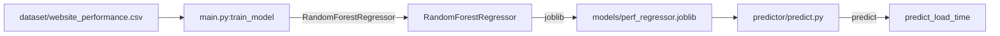

# Website Performance Predictor

Regression model that estimates web page load time from resource metrics using Random Forest Regressor.

## Overview

Estimates web page load time from resource metrics using a Random Forest Regressor trained on a CSV dataset of website performance data.

## Core Architecture



## System Components

| Component | Responsibility |
|---|---|
| `main.py` | Entry point, training, demo prediction |
| `trainer/train.py` | Model training pipeline |
| `predictor/predict.py` | Inference logic |
| `crawler/html_analyzer.py` | HTML metric extraction |
| `models/` | Serialized joblib models |

## Technology Stack

| Layer | Technology | Purpose |
|---|---|---|
| Language | Python 3.8+ | Core implementation |
| ML | scikit-learn | Random Forest Regressor |
| Serialization | joblib | Model persistence |
| Data | CSV + pandas | Training data |

## Requirements

- Python 3.8+
- pip

## Configuration

| File | Purpose |
|---|---|
| `requirements.txt` | Python dependencies |
| `dataset/website_performance.csv` | Training data |

## Getting Started

```bash
cd website-performance-predictor
pip install -r requirements.txt
python main.py
```
